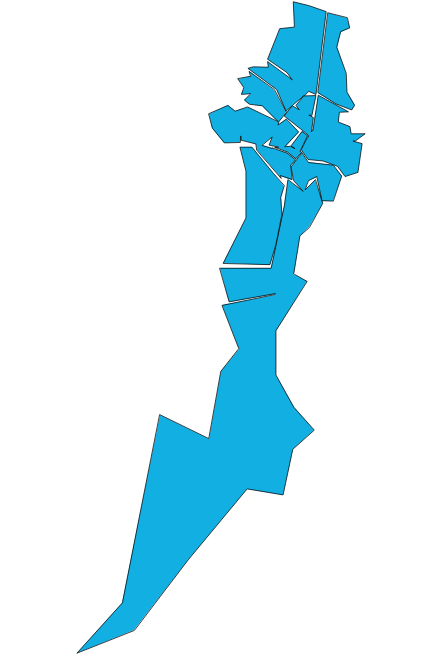

.. |PG| replace:: PostGIS

*****************
Análisis espacial
*****************
El análisis de datos con SIG tiene por finalidad descubrir estructuras espaciales, asociaciones y relaciones entre los datos, así como modelar fenómenos geográficos. Los resultados reflejan la naturaleza y calidad de los datos, además de la pertinencia de los métodos y funciones aplicadas. Las tareas y transformaciones que se llevan a cabo en el análisis espacial precisan datos estructurados, programas con las funciones apropiadas y conocimientos sobre la naturaleza del problema, para definir los métodos de análisis.

El proceso convierte los datos en información útil para conocer un problema determinado. Es evidente que los resultados del análisis espacial añaden valor económico y, sobre todo, información y conocimiento a los datos geográficos

Operadores espaciales
=====================
Estos son los encargados de realizar operaciones geométricas entre las geometrías que se les pasa como argumentos. Están definidos en la norma SFA y |PG| soporta todos ellos. 

Buffer
------
Es el conjunto de puntos situados a una determinada distancia de la geometría

	.. image:: _images/st_buffer.png
		:scale: 50%
	
Acepta distancias negativas, pero estas en lineas y puntos devolverán el conjunto vacio.
	
Práctica
^^^^^^^^

	.. warning:: TODO

	
Intersección
------------
Genera una geometría a partir de la intersección de las geometrías que se les pasa como parámetros. 
	
	.. image:: _images/intersection.jpg
		:scale: 50%
	
¿Cúal es el area en común de dos círculos situados en los puntos (0 0) y (3 0) de radio 2?::

	SELECT ST_AsText(ST_Intersection(
	  ST_Buffer('POINT(0 0)', 2),
	  ST_Buffer('POINT(3 0)', 2)
	));
	

Práctica
^^^^^^^^

	¿Cuál es el área total de páramos contenidos en todos los barrios de Bogotá?
	Pista: usar las tablas **barrios_de_bogota** y **paramoscundinamarca**

	Resultado (BORRAR)::

	#select sum(np.hectares) as total_area_ha 
	from barrios_de_bogota b join paramoscundinamarca np
	on st_intersects(b.geom, np.geom)
	
Unión
-----
Al contrario que en el caso anterior, la unión produce un una geometría común con las geometrías que se le pasa a la función como argumento. Esta función acepta como parámetro dos opciones, las geometrías que serán unidas::

	ST_Union(Geometría A, Geometría B)
	
o una colección de geometrías::

	ST_Union([Geometry])
	

.. image:: _images/union.jpg
	:scale: 50%
	
Práctica
^^^^^^^^

	Tratar de simplificar todos los barrios de Bogotá en un único polígono. El aspecto que presenta la tabla con los barrios de Bogotá es el siguiente:

	.. image:: _images/barrios_de_bogota.png
		:scale: 50%

Una primera aproximación podría ser usar la versión agregada de **ST_Union**, que toma como entrada un conjunto de geometrías y devuelve la unión de las mismas también como geometría. El conjunto de geometrías lo obtenemos gracias al uso de *GROUP BY*, que agrupa las filas por un campo común (en este caso, el campo *city*, que en todos los casos tiene el valor *Bogota*). 

Usamos adicionalmente la función **ST_SnapToGrid** para ajustar la geometría de salida lo más posible a la rejilla regular definida por su origen y su tamaño de celda. 

La consulta SQL es ésta::

	#CREATE TABLE bogota AS
 	SELECT ST_Union(ST_SnapToGrid(geom,0.0001)) 
 	FROM barrios_de_bogota
 	GROUP BY city;

Y el resultado es el conjunto de polígonos, algo más suavizados:

Si queremos intentar simplificar aun más esta geometría, tendríamos dos opciones:
	
	* Utilizar GRASS para obtener una simplificación topológica de la geometría
	* Utilizar la extensión **topology** de PostGIS. Veremos esta aproximación en el apartado dedicado a topología.

	
Diferencia
----------
La diferencía entre dos geometrías A y B, son los puntos que pertenecen a A, pero no pertenecen a B

	.. image:: _images/STDifference.png
		:scale: 50%
		
::

	ST_Difference(Geometría A, Geometría B)

Diferencia simétrica
--------------------
Es el conjunto de puntos que pertenecen a A o a B pero no a ambas.

	.. image:: _images/symdifference.gif

::

	ST_SymDifference(Geometría A, Geometría B)
	
Tipos de geometrías devueltas
-----------------------------

El tipo de geometrías que devuelven estas operaciones no tienen porque ser igual al tipo de geometrías que le son pasadas como argumentos. Estas operaciones devolverán:

	* Una única geometría
	* Una geometría *Multi* si está compuesta por varias geometrías del mismo tipo
	* Una *GeometryCollection* si está formada por geometrías de distinto tipo.
	
En este último caso habrá que proceder a una homogeneización de las geometrías que son devueltas, para ello podremos utilizar diferentes estrategias:

	* El uso de clausulas de filtrado, por ejemplo indicando que solo se devuelvan aquellas geometrías cuya intersección sea una línea.
	* Crear las tablas de salida de tipo *Multi*, en este caso las geometrías que no sean multi podrán ser convertidas a este tipo mediante la función ``ST_Multi``
	* En caso de que las geometrías devueltas sean tipo *GeometryCollection*, será necesario iterar esta colección, y extraer mediante la función ``ST_CollectionExtract`` las geometrías en las que estamos interesados, indicandole para ello a la función la dimensión de las geometrías.

Transformación y edición de coordenadas
=======================================
Mediante el uso de diferentes funciones seremos capaces de manejar transformaciones entre sistemas de coordenadas o hacer reproyeciones de las capas. Para un manejo básico de estas utilizaremos las funciones que |PG| pone a nuestra disposición:

	* **ST_Transform(geometría, srid)**, que nos permite la transformación de la geometría al SRID que le pasamos por parámetro.
	* **ST_SRID(geometria) nos muestra el SRID de la geometría
	* **ST_SetSRID(geometria, srid)** asigna el SRID a la geometría pero sin relizar la transformación
	
En la tabla ``spatial_ref_sys`` encontraremos la definición de los sistemas de coordenadas de los que disponemos. Podremos consultar la descripción de ellos mediante consultas ``select`` del estilo::

	# select * from spatial_ref_sys where srid=4326;
	
Para transformar las geometrías en otros sistemas de coordenadas, lo primero que debemos saber es el sistema de coordenadas de origen y el de destino. Hemos de consultar que estos se encuentran en la tabla ``spatial_ref_sys``. En caso de que alguna de nuestras tablas no tenga asignado un SRID, el valor de este será -1, valor por defecto, por lo que habrá que asignarle el sistema de coordenadas antes de la transformación.

Práctica
--------

	¿Cuanto mide el rio más largo de la tabla CRI_rios?. Comprobar el sistema de coordenadas original y las medidas para realizar el cálculo.

	¿Cual es la provincia que más longitud de rios contiene?
	
	De la capa de reservas naturales extraer en una capa aquellas que son del mismo tipo ``desig``
	
	Comprobar la provincia que tiene más superficie de espacios naturales del tipo ``Biological Reserve``
	
	Separar en tablas las carreteras en función del tipo (RTT_DESCRI)
	
	Calcular las reservas del tipo ``Protective Zone`` que son atravesadas por una carretera de cualquier tipo y calcular la superficie de las zonas separadas

	Unir en una sola zona aquellas zonas protegidas (``Protective Zone``) que pertenezcan a una sola provincia exclusivamente y crear una nueva capa con ellas
	
	¿Cuales de las reservas de tipo Refugio natural de vida salvaje (National Wildlife Refuge) tienen parte marina?
	
	Crear una tabla con las ciudades de Costa Rica.
	
	
